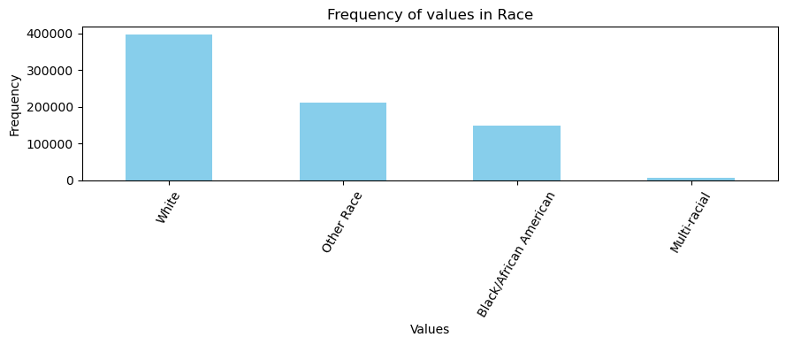
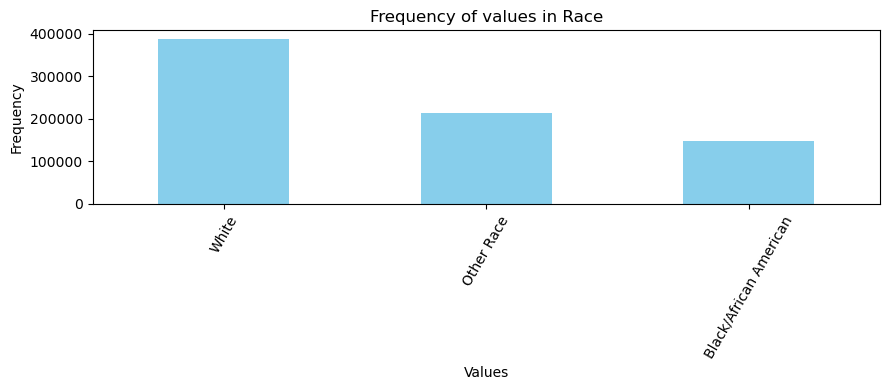
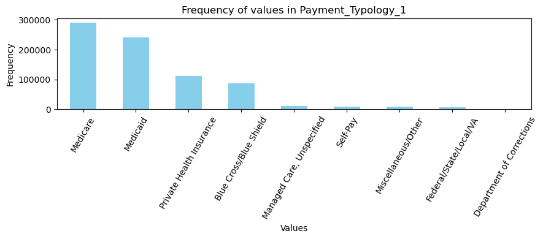
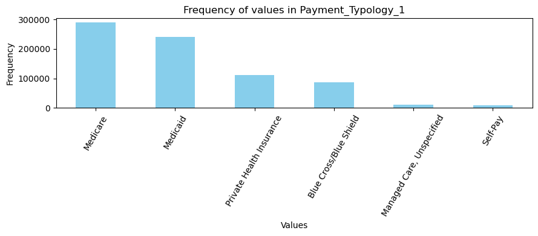

# Patient Length of Stay Prediction with Initial Information (Group 18)

Authors: Cagri Ozmemis, Hardik Dhaval Patel, Varun Ramakrishnan

## Introduction

### Background

The ability to forecast patient length of stay with initial information (PLOSWI) upon patient intake allows hospitals to make informed operational decisions and provide optimal patient care,
ultimately increasing resource allocation and decreasing costs.
In this project, we focus on developing a machine learning solution tailored to address the challenge of predicting patient length of stay based on data collected at the time of admission using both supervised and unsupervised learning methods.

### Dataset

Our dataset will be [real-world patient records acquired and made public by New York state hospitals in 2021](https://data.world/johnsnowlabs/hospital-inpatient-treatment-discharges-2021).
The dataset includes over one million data points, with 32 features.
Some of the notable features are basic patient information (age, gender, ethnicity) as well as diagnosis information (a code and description).

### Literature Review

Most LOS prediction literature focus on a specific illness and rely on advanced medical information by assuming an ongoing stay [[1]](#1) [[2]](#2) [[3]](#3). Additionally, there exists a limited literature that is parallel to ours. For example, Turgeman et al. [[4]](#4) created a "Cubist" rule-based regression model to predict PLOWSI using data from Veterans Health Administration in Pittsburgh, PA. Turgeman et al. used tree-based regression models with the intention of understanding the factors governing length of stay. They also describe prior research to predict length of stay including a C5.0 tree, Naive-Bayes model, K-nearest neighbours, a Multi-Layer Neural Network, and support-vector regression.

Barnes et al. [[5]](#5) worked on a slightly different approach of predicting length of stay in real-time, constantly updating the predictions at specified time intervals.
Our project aims to make inferences at the time of intake, which we believe would be more feasible to integrate into healthcare systems.

## Problem Definition

Our problem centers on predicting patient length of stay with initial information (PLOSWI) in a hospital setting.
Our primary aim is to assist managerial decision-making processes within a single hospital or any healthcare facility providing inpatient care.
Specifically, we seek to forecast the duration of a patient's stay upon admission, relying solely on data collected on the admission day, such as demographics, diagnosis, severity of illness, treatment procedure decision, and risk of mortality.
Our objective is to predict the length of stay for newly admitted patients.
This predictive capability is vital for the hospital's capacity planning and resource allocation, ultimately leading to improved utilization and reduced costs.

Source:[Intermountain Healthcare](https://intermountainhealthcare.org/medical-specialties/behavioral-health/)

## Methods
### Data Preprocessing
We start data preprocessing by discarding the unneccessary features and keeping only the useful ones. Among 32 features, we find 19 to be suitable, which are 'Age_Group', 'Gender', 'Race', 'Ethnicity', 'Type_Of_Admission', 'Diagnosis_Description', 'Procedure_Description', 'APR_DRG_Description', 'APR_MDC_Description', 'APR_Severity_Of_Illness_Description', 'APR_Risk_Of_Mortality', 'APR_Medical_Surgical_Description', 'Payment_Typology_1', 'Is_Emergency_Department_Indicator', 'Length_Of_Stay'. Here, 'Length_Of_Stay' stay denotes the target value that we are trying to predict with ML algorithms. Afterwards, we clean the data from missing information. Since we have an enormous data with 1,046,218 entries, we directly discarded a data point if it has at least one missing feature. This process left us with 764,953 data points.

Later we plotted the frequency of each unique entry for each data features separately to be able to observe an abnormal behavior. Upon our initial observation of plots, first, we noticed that 'Gender' feature has rarely unkown entries indicated with 'U'. So, we discarded unknown gender entries. Similarly, we discarded entries having 'Not Available' for 'Type_Of_Admission' features. Later, in 'Race' feature, we noticed that although there are only a few entries having 'Multi-racial', the average LOS value of these entries were significantly close to average LOS value of entries having 'Other race'. Since, these two unique values are close to each other semantically, we merge them to increase homogeneity of data. We also discarded an entire feature which is 'Ethnicity', because it is significantly low in terms of Entropy and carries a similar information with 'Race' feature at a different level. Finally, we examined 'Payment_Typology_1' column and observe that 'Miscellaneous/Other', 'Federal/State/Local/VA', 'Department of Corrections' values does not carry any contextual information and very seldom in number. Therefore, we deducted entries having these values. We refer the reader to the file 'Data_Cleaning.ipynb' where all frequency plots are located. To save space in our report, we only provide two examples of frequency plots before and after the aforementioned processing steps. Below is the before and after frequency plots for features.

 

 

### Unsupervised Learning

### Supervised Learning

## Results and Discussion

### Unsupervised Learning

### Supervised Learning

### Next Steps

## References

<a id="1">[1]</a>
T.A. Daghistani, R. Elshawi, S. Sakr, A.M. Ahmed, A. Al-Thwayee, M.H. Al-Mallah,
"Predictors of in-hospital length of stay among cardiac patients: A machine learning approach,"
*International Journal of Cardiology*,
vol. 288,
August 2019,
Pages 140-147,
https://doi.org/10.1016/j.eswa.2017.02.023](https://doi.org/10.1016/j.ijcard.2019.01.046

<a id="2">[2]</a>
R. Houthooft, J. Ruyssinck, J. van der Herten, S. Stijven, I. Couckuyt, B. Gadeyne, F. Ongenae, K. Colpaert, J. Decruyenaere, T. Dhaene, F. De Turck,
"Predictive modelling of survival and length of stay in critically ill patients using sequential organ failure scores,"
*Artificial Intelligence in Medicine,
vol. 63,
March 2015,
Pages 191-207,
https://doi.org/10.1016/j.artmed.2014.12.009

<a id="3">[3]</a>
B. Alsinglawi, O. Alshari, M. Alorjani, O. Mubin, F. Alnajjar, M. Novoa, O. Darwish,
"An explainable machine learning framework for lung cancer hospital length of stay prediction,"
*Scientific Reports*,
vol. 12,
January 2022,
https://doi.org/10.1016/j.eswa.2017.02.023](https://doi.org/10.1038/s41598-021-04608-7

<a id="4">[4]</a>
L. Turgeman, J. May, and R. Sciulli,
"Insights from a machine learning model for predicting the hospital Length of Stay (LOS) at the time of admission,"
*Expert Systems with Applications*,
vol. 78,
July 2017,
Pages 376-385,
https://doi.org/10.1016/j.eswa.2017.02.023

<a id="5">[5]</a>
S. Barnes, E. Hamrock, M. Toerper, S. Siddiqui, S. Levin,
"Real-time prediction of inpatient length of stay for discharge prioritization",
*Journal of the American Medical Informatics Association*,
vol. 23,
April 2016,
Pages e2–e10,
https://doi.org/10.1093/jamia/ocv106

## Appendix

### Contribution Table

| Name               | Contribution                                                                                             |
|--------------------|----------------------------------------------------------------------------------------------------------|
| Cagri Ozmemis      | Data Preprocessing, Unsupervised Learning algorithm development                                          |
| Hardik D. Patel    | Data Preprocessing, Supervised Learning algorithm development                                            |
| Varun Ramakrishnan | Data Visualization, Supervised Learning algorithm development                                            |
| Max T. Pan         | -                                                                                                        |

### Gantt Chart

