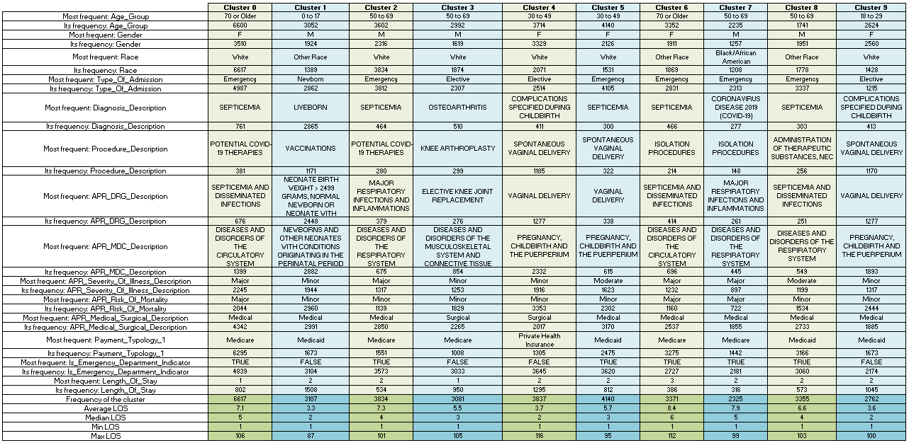

# Patient Length of Stay Prediction with Initial Information (Group 18)

Authors: Cagri Ozmemis, Hardik Dhaval Patel, Varun Ramakrishnan

## Introduction

### Background

The ability to forecast patient length of stay with initial information (PLOSWI) upon patient intake allows hospitals to make informed operational decisions and provide optimal patient care,
ultimately increasing resource allocation and decreasing costs.
In this project, we focus on developing a machine learning solution tailored to address the challenge of predicting patient length of stay based on data collected at the time of admission using both supervised and unsupervised learning methods.

### Dataset

Our dataset will be [real-world patient records acquired and made public by New York state hospitals in 2021](https://data.world/johnsnowlabs/hospital-inpatient-treatment-discharges-2021).
The dataset includes over one million data points, with 32 features.
Some of the notable features are basic patient information (age, gender, ethnicity) as well as diagnosis information (a code and description).

### Literature Review

Most LOS prediction literature focus on a specific illness and rely on advanced medical information by assuming an ongoing stay [[1]](#1) [[2]](#2) [[3]](#3). Additionally, there exists a limited literature that is parallel to ours. For example, Turgeman et al. [[4]](#4) created a "Cubist" rule-based regression model to predict PLOWSI using data from Veterans Health Administration in Pittsburgh, PA. Turgeman et al. used tree-based regression models with the intention of understanding the factors governing length of stay. They also describe prior research to predict length of stay including a C5.0 tree, Naive-Bayes model, K-nearest neighbours, a Multi-Layer Neural Network, and support-vector regression.

Barnes et al. [[5]](#5) worked on a slightly different approach of predicting length of stay in real-time, constantly updating the predictions at specified time intervals.
Our project aims to make inferences at the time of intake, which we believe would be more feasible to integrate into healthcare systems.

## Problem Definition

Our problem centers on predicting patient length of stay with initial information (PLOSWI) in a hospital setting.
Our primary aim is to assist managerial decision-making processes within a single hospital or any healthcare facility providing inpatient care.
Specifically, we seek to forecast the duration of a patient's stay upon admission, relying solely on data collected on the admission day, such as demographics, diagnosis, severity of illness, treatment procedure decision, and risk of mortality.
Our objective is to predict the length of stay for newly admitted patients.
This predictive capability is vital for the hospital's capacity planning and resource allocation, ultimately leading to improved utilization and reduced costs.

Source:[Intermountain Healthcare](https://intermountainhealthcare.org/medical-specialties/behavioral-health/)

## Data Preprocessing
We start data preprocessing by discarding the unneccessary features and keeping only the useful ones. Among 32 features, we find 19 to be suitable, which are 'Age_Group', 'Gender', 'Race', 'Ethnicity', 'Type_Of_Admission', 'Diagnosis_Description', 'Procedure_Description', 'APR_DRG_Description', 'APR_MDC_Description', 'APR_Severity_Of_Illness_Description', 'APR_Risk_Of_Mortality', 'APR_Medical_Surgical_Description', 'Payment_Typology_1', 'Is_Emergency_Department_Indicator', 'Length_Of_Stay'. Here, 'Length_Of_Stay' stay denotes the target value that we are trying to predict with ML algorithms. Afterwards, we clean the data from missing information. As our dataset contains a vast amount of information, totaling 1,046,218 entries, we opted to eliminate any data points that possessed at least one missing feature. This process resulted in a remaining dataset of 764,953 data points.

Later, we plotted the frequency of each unique entry for each data feature separately to identify any abnormal behavior. Initially, we observed that the 'Gender' feature had rarely occurring entries marked as 'U' for unknown. These unknown gender entries were discarded. Similarly, entries with 'Not Available' for the 'Type_Of_Admission' feature were also discarded.

Subsequently, in the 'Race' feature, we noticed that although there were only a few entries labeled as 'Multi-racial', their average length of stay (LOS) values were remarkably close to those labeled as 'Other race'. As these two unique values are semantically similar, we merged them to enhance the data's homogeneity. Additionally, we eliminated the 'Ethnicity' feature due to its low entropy and redundant information compared to the 'Race' feature at a different level.

Furthermore, upon examining the 'Payment_Typology_1' column, we found that values such as 'Miscellaneous/Other', 'Federal/State/Local/VA', and 'Department of Corrections' carried negligible contextual information and were infrequent. Hence, entries with these values were deducted.

After these data cleaning steps, the number of data points was reduced to 749,815. For further details and visualization, we direct the reader to the 'Data_Cleaning.ipynb' file, which contains all frequency plots. To conserve space in our report, we provide only two examples of frequency plots before and after the aforementioned processing steps. Below are the before and after frequency plots for the features.

 

 

Since our data consists entirely of categorical variables, we employ frequency-based methods for outlier detection. In this process, we specifically target the 'Diagnosis_Description', 'Procedure_Description', and 'APR_DRG_Description' features due to their notably high number of unique values (467, 319, and 332, respectively). To identify outliers, we employ the percentile technique, considering values as outliers if their frequency falls below the 25th percentile. Consequently, we detect values with frequencies below this threshold and exclude them from our dataset. Following this procedure, the number of entries is reduced to 728,589.

We previously mentioned that we ended up with 728,589 data points in the final version of our dataset after preprocessing steps. However, this quantity still poses significant challenges in terms of speed and memory usage during algorithm development. To address this, we create three random samples representing 5%, 10%, and 15% of our data while maintaining the distribution of values in the target feature 'Length_Of_Stay'. For instance, in the 5% sample, we extract 5% of each unique value in the 'Length_Of_Stay' column. This ensures that the distribution of unique 'Length_Of_Stay' values in the original dataset is preserved.

For further details on our preprocessing efforts and frequency plots, we direct the reader to the 'Data_Cleaning.ipynb' file.

## Methods

### Unsupervised Learning

#### K-means

For the unsupervised learning algorithm, we decided to start with K-means method, and proceed to more complex algorithms if K-means alone cannot account for the sufficient explanation of the data dynamics. To be on the safe side, along with SKLearn's built-in function, we developed our own K-means algorithm, and analyze the results produced by both. 

Moreover, we tune parameters and configurations for our algorithms. Namely, we try different numbers of clusters, initilazition methods, and feature selections. Below, we provide how we proceed with each of those.

* Number of clusters: We try eight different values for number of clusters between 3 and 10.
* Intialization method: We employ both random and K-means++ methods to initialize the cluster centroids.
* Feature selection: Due to the categorical nature and abundance of unique values in the 'Diagnosis_Description', 'Procedure_Description', and 'APR_DRG_Description' features, using them could lead to issues of over-complexity. Hence, we opt to discard them initially. However, we remain open to reconsidering their inclusion if our algorithm fails to adequately explain the data without them. Additionally, since we are conducting an unsupervised experiment, we eliminate our target feature. Thus, we proceed with the remaining ten features for algorithm development: 'Age_Group', 'Gender', 'Race', 'Type_Of_Admission', 'Payment_Typology_1', 'Is_Emergency_Department_Indicator', 'APR_MDC_Description', 'APR_Severity_Of_Illness_Description', 'APR_Risk_Of_Mortality', 'APR_Medical_Surgical_Description'. For these features, we find it suitable to apply Forward Feature Selection (FFS). However, considering all possible combinations of ten features would result in 1023 feature selection configurations, consuming substantial CPU time. To mitigate this, we fix six attributes in our configurations, selecting the simplest ones with the least medical information. These fixed features are: 'Age_Group', 'Gender', 'Race', 'Type_Of_Admission', 'Payment_Typology_1', and 'Is_Emergency_Department_Indicator'. Furthermore, we apply FFS to explore different combinations of the four advanced medical features: 'APR_MDC_Description', 'APR_Severity_Of_Illness_Description', 'APR_Risk_Of_Mortality', and 'APR_Medical_Surgical_Description'. This process results in 16 feature selection configurations.

We initially conducted experiments with varying numbers of iterations, starting with the default of 300 provided by SKlearn's built-in function. However, increasing the number of iterations did not yield different results. Therefore, to be efficient in terms of CPU time, we stick to using 300 iterations for our algorithms.

Next, we execute both our developed K-means algorithm and the built-in function a total of 256 times. This is achieved by considering 8 clusters, 2 initialization methods, and 16 feature selection configurations. We analyze the results using two metrics: the Silhouette Coefficient and the Beta-CV Measure. Since we lack true label information, we resort to internal measures rather than external ones like Precision, Recall, and F1. For the Beta-CV Measure, we develop our own algorithm, while for the Silhouette Coefficient, we utilize SKlearn's built-in function. 

For a detailed examination of our efforts in this section, we direct the reader to the 'kmeans_develop.ipynb' file.

### Supervised Learning

For the supervised learning algorithm, we decided to start with a multiple linear regression model with all independent variables. Using one-hot encoding we numericalized the categorical variables, however that left us with many additional variables to regress on. We kept testing for more models that could help explain the variation in our dependent variable, "Length of Stay." We implemented basic ridge and lasso regression models, however there seemed to be a need of major fine tuning before those models could be useful to us. We then implemented a basic random forest model that seemed like it did a decent job. 

Knowing that we needed to reduce the number of our variables possibly due to multicollinearity, we implemented code to check the VIF of each independent variable to identify variables with hihg multicollinearity. We also looked into a PCA approach by trying to find the optimal amount of variables. 
## Results and Discussion

### Unsupervised Learning

#### K-means

Below, we present two tables listing the Silhouette Coefficient (in descending order) and Beta-CV Measure (in ascending order) for each algorithm configuration, initialization method, and number of clusters. Since the tables have 512 lanes, in order to save space in our report, we only provide the first 29 rows for both tables.

   

We note that employing different feature selection configurations does not alter the Silhouette Coefficient and Beta-CV Measure, as the majority of best result are obtained through six primal information which are fixed. This observation indicates that our decision to utilize basic admission information, comprising 'Age_Group', 'Gender', 'Race', 'Type_Of_Admission', 'Payment_Typology_1', and 'Is_Emergency_Department_Indicator', is justified, and these features alone are adequate for effective clustering. Moreover, as shown in the table, SKlearn's built-in function with 10 clusters and K-means++ initialization yields the best reusults both in terms of Silhouette Coefficient and Beta-CV Measure. Consequently, we utilize its outcomes to investigate clustering dynamics.

These findings suggest that through our unsupervised learning algorithm, utilizing only 'Age_Group', 'Gender', 'Race', 'Type_Of_Admission', 'Payment_Typology_1', and 'Is_Emergency_Department_Indicator' information, we can predict the duration of a patient's hospital stay. Furthermore, we observe distinct boundaries in terms of Length of Stay (LOS) when transitioning from one cluster to another, except for the transition from Cluster 0 to Cluster 4. In this case, there is an overlap in LOS values of 2 and 3 days. This overlap occurs because these clusters are grouped based on diagnosis descriptions and other key feature values, which may result in similar LOS outcomes.

To explain the motivation behind all clusterings concerning the feature values, we investigate how the clusters are structured based on the output generated by our selected algorithm configuration. We examine each feature for each cluster by extracting the following information:
* What is the most frequent categorical value?
* What is the frequency of the most frequent categorical value?
Furthermore, for each cluster, we provide the mean, median, minimum and maximum values of their LOS information. The table below provides the aforementioned information, aiding us in uncovering and comprehending the underlying patterns within the clusters.

 

Since we input attributes such as 'Age_Group', 'Gender', 'Race', 'Type_Of_Admission', 'Payment_Typology_1', and 'Is_Emergency_Department_Indicator' into our algorithm, it's unsurprising that the clusters exhibit homogeneity regarding the categorical values of these features. Consequently, it is essential to examine the frequencies of data not provided to the algorithm, specifically the advanced medical information. We note that clusters predominantly consist of COVID-19 and childbirth-related admissions, along with a distinct cluster focused on Osteoarthritis admissions, typically involving knee surgery. These groups are further subdivided based on various criteria like the specific procedure performed, medical versus surgical treatment, risk of mortality, and detailed diagnostic descriptions. For example, COVID-19 related admissions are further splitted into clusters according to the treatment process such as isolation, administration of therapeutic substances and potential COVID-19 therapies, and risk of mortality levels are varying across clusters as etiher minor or major. With respect to childbirth, we see further clusterings based on whether it is a vaginal delivery or a newborn vaccination,the mother's age interval, severity of illnes being minor or moderate. 

Analyzing the mean, median, minimum, and maximum values of Length of Stay (LOS) across clusters reveals diverse patterns that reflect different characteristics of hospital admissions. Hence, our unsupervised learning efforts provide hospital managers with a preliminary estimate of LOS, enabling swift decisions for planning and resource allocation. Initially, it is crucial for managers to distinguish between childbirth and COVID-19 admissions. They can then categorize various types of admissions further based on severity of illness, risk of mortality, treatment procedures, and diagnostic details. For a more precise prediction of LOS that includes all types of admissions—not limited to childbirth, COVID-19, and Osteoarthritis—managers can utilize our supervised learning algorithm.

We refer the reader to the 'kmeans_analysis.ipynb' to examine our efforts described in this section.

### Supervised Learning

The $R^2$ value for the regular linear regression model was only about 0.4.
Only 40% of the variation being explained by our model is not sufficient at all, but most likely due to multicollinearity from the sheer number of independent variables.

We also implemented a Random Forest model, which yielded much better results with an $R^2$ of 0.74.

We also performed PCA analysis on our dataset, finding the explained variance associated with each component:

Ultimately, our supervised learning results show that it is possible to use regression models to predict the length of stay as a continuous variable (not in clusters) with reasonable accuracy.
This provides more granular and fine-grained planning capabilities to hospitals.
However, there is still a lot of work that needs to be done.
First, we need to address the problem of multi-collinearity from the number of duplicate variables we have.
In the future, we could try Lasso Regression to decrease the number of variables. We could also implement a forward or backward feature selection algorithm to help fine tune our regression models.
PCA analysis can also be further explored, to reduce the dimensionality of our dataset.

### Next Steps
In the remainder of the project, we will create additional unsupervised and supervised learning algorithms and assess their performances through comparison.
We will also perform further investigation into feature selection to address multi-collinearity and will additionally fine tune our existing models.

## References

<a id="1">[1]</a>
T.A. Daghistani, R. Elshawi, S. Sakr, A.M. Ahmed, A. Al-Thwayee, M.H. Al-Mallah,
"Predictors of in-hospital length of stay among cardiac patients: A machine learning approach,"
*International Journal of Cardiology*,
vol. 288,
August 2019,
Pages 140-147,
https://doi.org/10.1016/j.eswa.2017.02.023](https://doi.org/10.1016/j.ijcard.2019.01.046

<a id="2">[2]</a>
R. Houthooft, J. Ruyssinck, J. van der Herten, S. Stijven, I. Couckuyt, B. Gadeyne, F. Ongenae, K. Colpaert, J. Decruyenaere, T. Dhaene, F. De Turck,
"Predictive modelling of survival and length of stay in critically ill patients using sequential organ failure scores,"
*Artificial Intelligence in Medicine,
vol. 63,
March 2015,
Pages 191-207,
https://doi.org/10.1016/j.artmed.2014.12.009

<a id="3">[3]</a>
B. Alsinglawi, O. Alshari, M. Alorjani, O. Mubin, F. Alnajjar, M. Novoa, O. Darwish,
"An explainable machine learning framework for lung cancer hospital length of stay prediction,"
*Scientific Reports*,
vol. 12,
January 2022,
https://doi.org/10.1016/j.eswa.2017.02.023](https://doi.org/10.1038/s41598-021-04608-7

<a id="4">[4]</a>
L. Turgeman, J. May, and R. Sciulli,
"Insights from a machine learning model for predicting the hospital Length of Stay (LOS) at the time of admission,"
*Expert Systems with Applications*,
vol. 78,
July 2017,
Pages 376-385,
https://doi.org/10.1016/j.eswa.2017.02.023

<a id="5">[5]</a>
S. Barnes, E. Hamrock, M. Toerper, S. Siddiqui, S. Levin,
"Real-time prediction of inpatient length of stay for discharge prioritization",
*Journal of the American Medical Informatics Association*,
vol. 23,
April 2016,
Pages e2–e10,
https://doi.org/10.1093/jamia/ocv106

## Appendix

### Contribution Table

| Name               | Contribution                                                                                             |
|--------------------|----------------------------------------------------------------------------------------------------------|
| Cagri Ozmemis      | Data Preprocessing, Unsupervised Learning algorithm development                                          |
| Hardik D. Patel    | Data Preprocessing, Supervised Learning algorithm development                                            |
| Varun Ramakrishnan | Data Visualization, Supervised Learning algorithm development                                            |
| Max T. Pan         | -                                                                                                        |

### Gantt Chart

